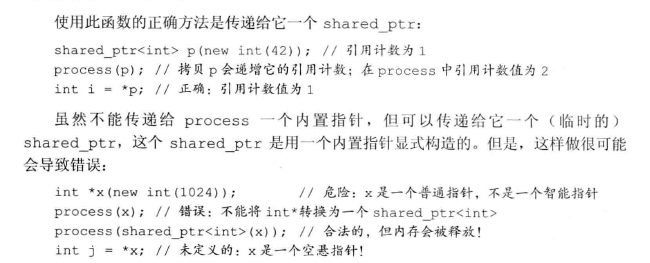

# 动态内存

memory头文件中提供了两种智能指针 shared_ptr 和 unique_ptr，shared_ptr允许多个指针指向同一个对象，unique_ptr则独占所指向的对象。

## shared_ptr

**shared_ptr 和 unique_ptr 都支持的操作**

``` Cpp
shared_ptr<T> sp;
unique_ptr<T> up;
*p //解引用，得其指向的对象
p->mem //等价于(*p).mem
p.get() //返回p保存的指针

swap(p, q); //交换p、q的指针
```

**Shared_ptr独有的操作**

```cpp
make_shared<T>(args)  //返回一个shared_ptr, 类型为T，用args初始化
std::shared_ptr<int> p = std::make_shared<int>(42);
auto p = std::make_shared<string>(10, '9');
//拷贝和赋值
auto p = std::make_shared<int>(10);
auto q(p); //p、q指向相同对象

p = q //p、q都是shared_otr，增加q的计数，减少p的计数
p.unique() //若p的引用计数为1，返回true
```

## 直接管理内存（堆内存）

new分配内存，delete删除new分配的内存。

```cpp
int* p = new int; //动态分配、未初始化

int* p = new int(1024);
string* p = new string(10, '9');
// const object
const int* p = new const int(1024);

//释放内存
delete p;  //p必须指向动态分配的对象
```

## shared_ptr 和 new混合使用

智能指针的构造函数是explicit的，不能将一个内置指针隐式转换为一个智能指针。

```cpp
shared_ptr<int> p = new int(1024); //错误，int*无法隐式转换为shared_ptr
shared_ptr<int> p(new int (1024)); //正确

int* p = new int(1024);
shared_ptr<int>p1(p);  //之后不要再用普通指针p
```

智能指针和普通指针不能混合使用。



智能指针使用规范

* 不用相同内置指针初始化多个智能指针。
* 不delete get返回的指针。
* 不适用get()初始化智能指针。

## 动态数组

new : 分配和初始化一个对象数组。
allocator: 将分配和初始化分离。

```cpp
int *pia = new int [10];  //10个未初始化的int
int *pia = new int [10]();  //10个初始化为0的int

delete [] pia; //p指向动态分配的数组
```
